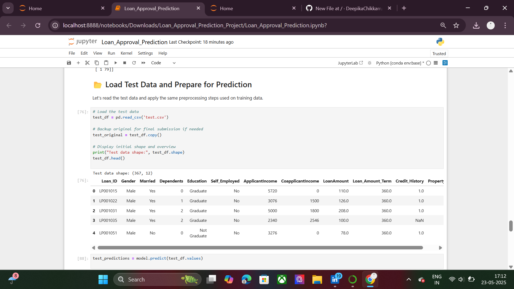

# Loan Approval Prediction 🏦✅

This project uses a **Logistic Regression** model to predict loan approvals based on applicant data. It involves data preprocessing, exploratory data analysis (EDA), model building, and final prediction on test data.

## 📁 Files Included
- `Loan_Approval_Prediction.ipynb` – Jupyter Notebook with full workflow (EDA, model training, predictions).
- `loan_prediction_submission.csv` – Final submission file with predictions.

## 🧠 Model Used
- **Logistic Regression**: A simple yet effective algorithm used for binary classification tasks (like loan approval – Yes/No).

## 📊 Steps Followed

1. **Data Preprocessing**:
   - Handled missing values using mode/median.
   - Encoded categorical variables.
   - Dropped unnecessary columns (`Loan_ID`).

2. **Exploratory Data Analysis**:
   - Analyzed distributions of features.
   - Visualized relationships (Gender vs Loan_Status, etc.).

3. **Model Training**:
   - Used `LogisticRegression()` from `sklearn`.
   - Trained using `train_test_split`.

4. **Prediction and Submission**:
   - Predicted on cleaned test data.
   - Saved output in CSV format for submission.

## 📌 How to Run
- Open the notebook using Jupyter.
- Run all cells in order.
- Final prediction file will be saved as `loan_prediction_submission.csv`.

## 📷 Screenshot
## 📸 Output Screenshot

## 🧑‍💻 Author
- **Chikkam Deepika**

## ⭐ GitHub
[https://github.com/DeepikaChikkam/Loan_Approval_Prediction]
(https://github.com/DeepikaChikkam/Loan_Approval_Prediction)
## 🔗 Connect with Me

- 📂 **GitHub**: [DeepikaChikkam](https://github.com/DeepikaChikkam)
- 💼 **LinkedIn**: [Deepika Chikkam](https://www.linkedin.com/in/deepika-chikkam-222b9629a/)

